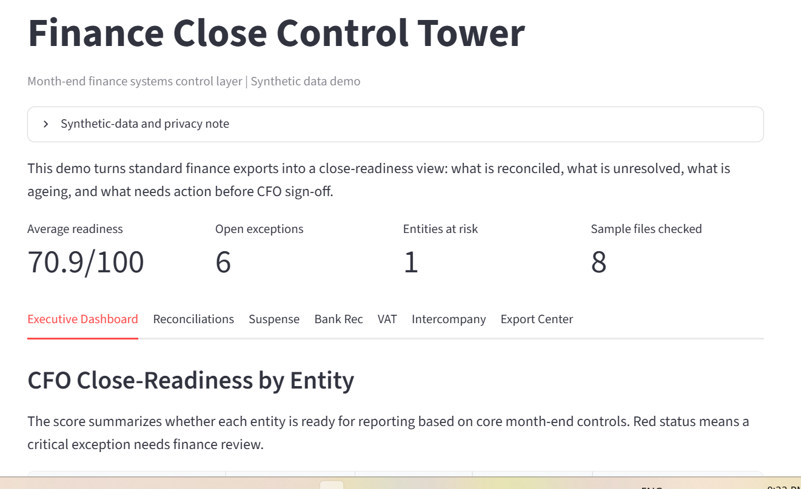
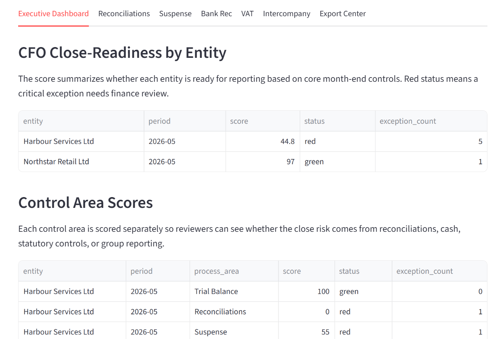
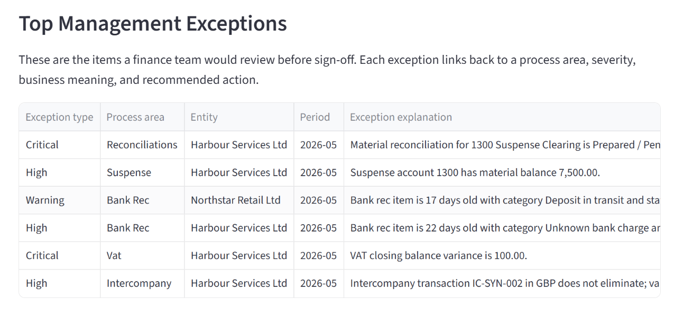
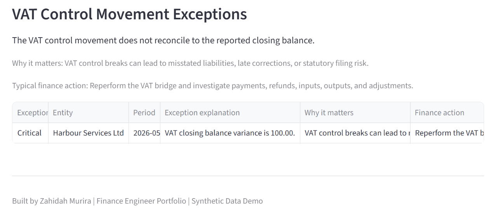
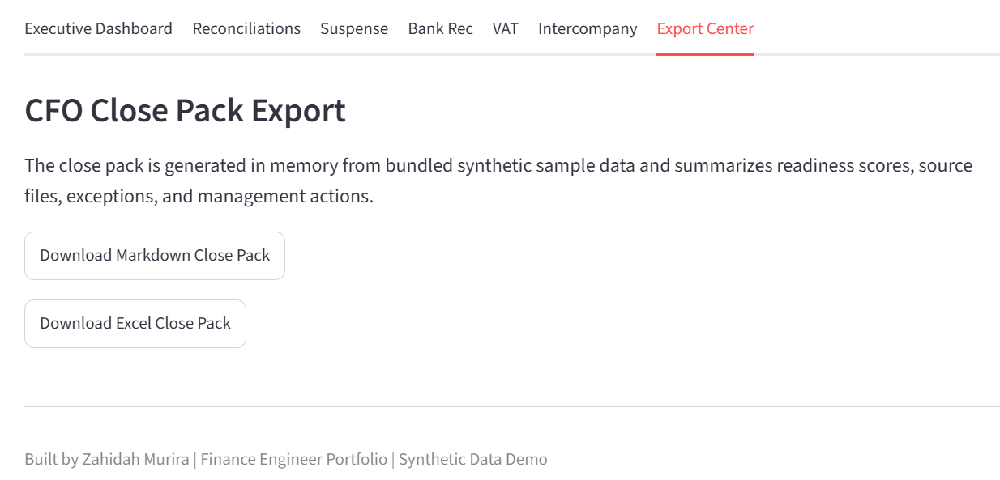

# Finance Close Control Tower


Finance Close Control Tower is a production-style finance systems control layer for month-end close readiness. It turns accounting exports into a CFO-ready view of reconciled balances, unresolved exceptions, ageing risk, material control issues, and actions needed before reporting.

This public demo uses synthetic sample data only. No employer, client, bank, payroll, supplier, customer, tax authority, or confidential company data is included.


Target portfolio roles:

- Finance Systems Analyst
- Finance Automation Specialist
- Finance Engineer
- FP&A Systems Analyst
- Close and Controls Analyst
- Analytics Engineer for finance operations

## Reviewer Takeaway

This project demonstrates finance engineering capability through:

- Finance systems judgement: translating month-end accounting exports into a control-oriented close view.
- Month-end close control logic: checking reconciliations, suspense, cash, VAT, and intercompany readiness.
- Deterministic automation: no LLM dependency, no hidden judgement calls, and repeatable sample outputs.
- Testable validation rules: finance calculations are implemented outside Streamlit and covered by pytest.
- Public-demo data protection: synthetic bundled data only, with no uploads, secrets, or private files required.

## Finance Problem

Month-end close is often slowed down by fragmented spreadsheets, manual trackers, unclear reconciliation status, aged suspense items, unresolved bank reconciliation breaks, VAT control variances, and intercompany mismatches. Finance managers need a concise control view that answers three practical questions:

- Can we trust the numbers enough to report?
- Which entities or process areas are blocking close readiness?
- What action should the finance team take before CFO sign-off?

This project demonstrates how finance systems thinking can turn ordinary accounting exports into structured controls, exceptions, scores, and management-ready reporting.

## What The App Does

- Loads bundled synthetic sample files from `data/sample/`.
- Validates file schemas and public-demo privacy guardrails.
- Runs deterministic close-control checks for trial balance integrity, reconciliations, suspense, bank rec, VAT, and intercompany.
- Calculates close-readiness scores by entity and process area.
- Displays a Streamlit dashboard with exception context and recommended finance actions.
- Exports a CFO close pack in polished PDF, Markdown, and Excel formats.

## Why The Controls Matter

| Control area | Business question | Why it matters |
| --- | --- | --- |
| Trial balance integrity | Do debits and credits balance by entity and period? | An unbalanced trial balance is a hard stop for reliable reporting. |
| Reconciliation completion | Are material balance sheet accounts prepared and reviewed? | Unreviewed reconciliations weaken balance sheet support and audit readiness. |
| Suspense clearing | Are clearing accounts still carrying material balances? | Suspense balances can hide miscoding, timing breaks, or unresolved accounting noise. |
| Bank reconciliation | Are cash reconciling items aged or unexplained? | Old or unknown cash items reduce confidence in reported cash. |
| VAT control movement | Does the VAT bridge reconcile to the closing balance? | VAT breaks can create statutory reporting and filing risk. |
| Intercompany matching | Do paired balances eliminate across entities? | Group reporting depends on mirrored intercompany balances before consolidation. |

## MVP Scope

- Validate standard finance export schemas before analysis.
- Generate reproducible synthetic trial balance, GL, reconciliation, ageing, bank, VAT, and intercompany files.
- Run privacy guardrails before sample data and close-pack outputs are published.
- Produce PDF, Markdown, and Excel close-pack artifacts for portfolio review.
- Keep all core logic deterministic and testable outside Streamlit.

## Quick Start

```powershell
python -m venv .venv
.\.venv\Scripts\python.exe -m pip install -e .[dev]
.\.venv\Scripts\python.exe scripts\generate_sample_data.py
.\.venv\Scripts\python.exe scripts\run_pipeline.py --data-dir data\sample --output-dir outputs\sample_close_pack
.\.venv\Scripts\python.exe -m pytest -q
```

To launch the Streamlit shell after installing dependencies:

```powershell
streamlit run app.py
```

The app runs entirely from bundled synthetic sample data. It does not require secrets, user uploads, external APIs, private files, database persistence, or cloud services.

## Demo Outputs

The sample pipeline writes portfolio-review artifacts to `outputs/sample_close_pack/`:

- `sample_close_pack_summary.md`: management summary, readiness scores, source files, and exception explanations.
- `sample_close_pack.xlsx`: CFO-style workbook with cover, overall scores, process scores, exceptions, and source-file summary.
- `sample_close_pack.pdf`: polished CFO-ready report with executive summary, risk highlights, and next steps.

## Screenshots

### App overview



### Executive close-readiness dashboard



### Management exception review



### VAT control exception review



### CFO close pack export



## Deployment Modes

The primary public deployment target is Streamlit Community Cloud, running from the GitHub repository with bundled synthetic sample data only. Docker and Google Cloud Run notes are included as production-style stretch guidance, not as a claim of live production deployment.

GitHub Pages may be used only for static documentation, screenshots, or a landing page. It is not a host for the Python Streamlit app.

See [docs/deployment.md](docs/deployment.md) for deployment commands, environment variables, and billing guardrails.

## Streamlit Community Cloud Public Demo

Public demo URL: `https://finance-close-control-tower.streamlit.app/`.

Deployment path:

1. Push this repository to GitHub.
2. In Streamlit Community Cloud, create an app from the GitHub repository.
3. Set the app entrypoint to `app.py`.
4. Use `requirements.txt` for runtime dependencies.
5. Do not add secrets for the MVP public demo.
6. Deploy with committed synthetic sample data only.

Public demo defaults:

- Read-only demo mode.
- No file upload widget in the current MVP shell.
- No API keys, tokens, LLM calls, live integrations, private exports, or real company data.
- GitHub Pages, if used later, is only for static documentation and screenshots.

## Portfolio Use and Reuse Restrictions

This repository is published as a professional portfolio project by Zahidah Murira. It is provided for demonstration and review only, with reuse restrictions described in [LICENSE](LICENSE), [NOTICE](NOTICE), and [SECURITY.md](SECURITY.md).

## Current Status

The current MVP implements the core sample-data workflow: bundled synthetic finance files, schema checks, deterministic validation rules, close-readiness scoring, Streamlit dashboard views, exception explanations, CFO close-pack exports, and tests for finance calculations.
